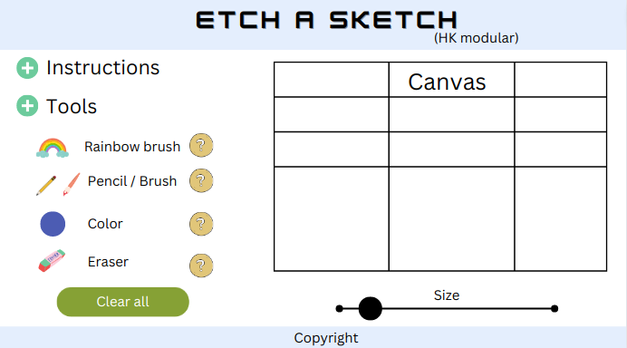

# Etch-a-sketch

My implementation of an Etch a Sketch (html, css, js) for The Odin Project.   

---

## Sketch sample:

   

---

##Notes    

Due the lack of compatibility, I prefered to use the "select tag" for the
resize button, instead the "range input type".
